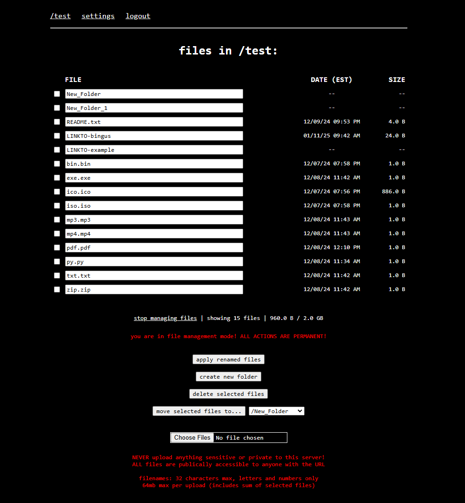

# python fileserver

a rudimentary python multi-user file host

this is currently being hosted at [f.elisttm.space](https://f.elisttm.space)
 also see [the user guide (README.txt)](uploads/public/README.txt)

## features

- user registration & authentication
- single-use registration keys
- rudimentary file management
- customizable local file links
- simple admin panel with logs
- sharex support

## todo

- filelist sorting
- simple file editor
- more user settings

## credits and thanks

- httpd file icons ([apache/httpd/tree/trunk/docs/icons](https://github.com/apache/httpd/tree/trunk/docs/icons))
- inspiration from hypnospace outlaw's flist

 

### owned filelist example

### file management example

### public filelist

### user settings tab

